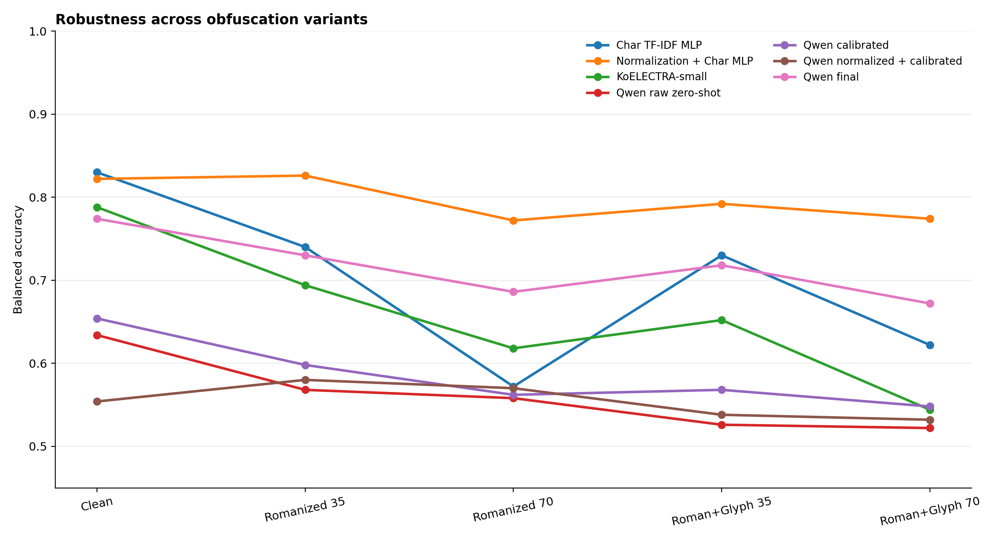
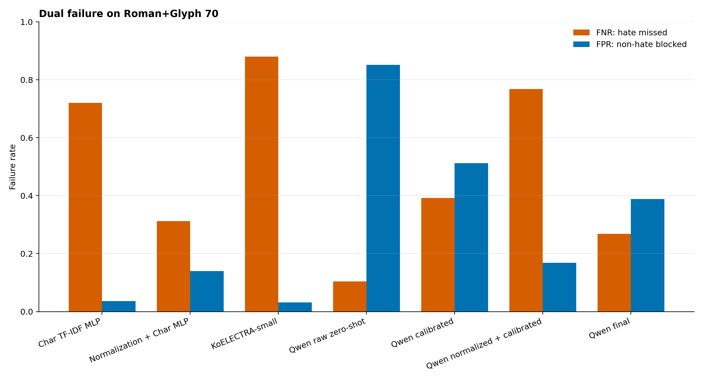
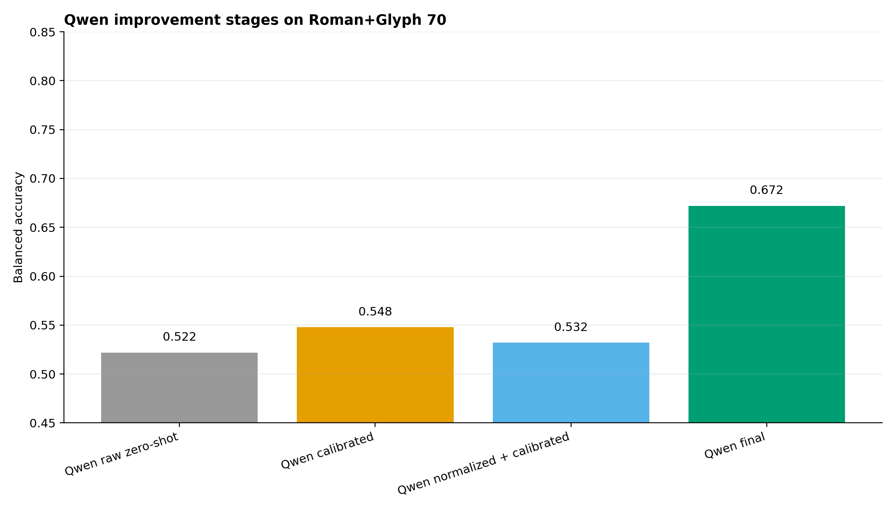
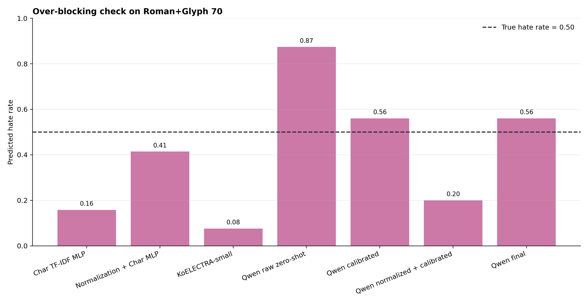
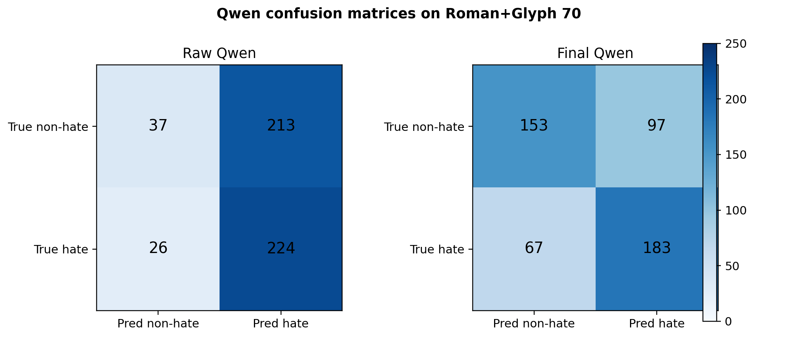
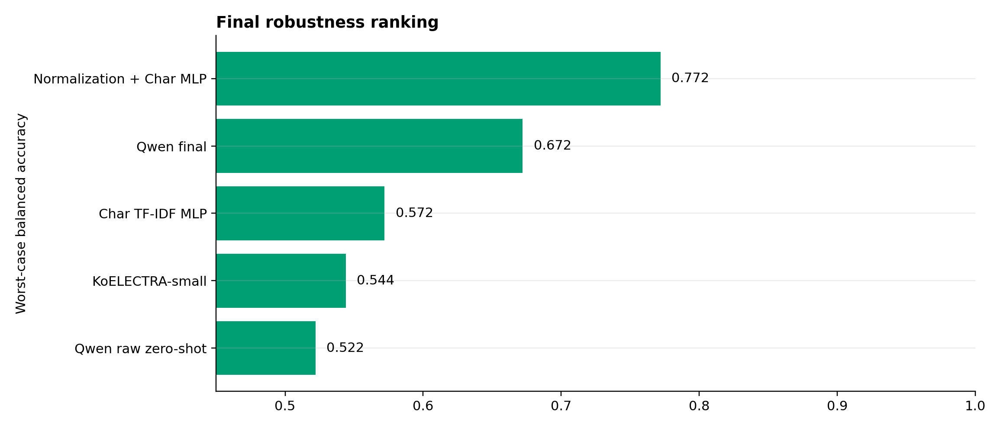

# 무료 LLM 비교 및 Qwen 개선 실험 결과

> K-MHaS의 동일한 test ID 500개를 다섯 난독화 variant로 변환해 전통 분류기와 로컬 sLLM을 비교하고, Qwen의 과잉 차단을 normalization, threshold calibration, LoRA로 개선하는 robustness 실험입니다.

## 1. 실험 상태

- 공통 test: 500개 base comment, hate/non-hate 250개씩
- 총 평가 입력: 모델당 2,500개
- Variant: `clean`, `romanized_35`, `romanized_70`, `roman_glyph_35`, `roman_glyph_70`
- 주 순위 지표: worst-case balanced accuracy
- 아직 외부 실행이 필요한 항목: Gemini API

## 2. 데이터와 누수 방지

- K-MHaS의 train, validation, test split을 그대로 분리했습니다.
- LoRA train ID, LoRA validation ID, threshold calibration ID, final test ID는 서로 겹치지 않습니다.
- `romanized_70`과 `roman_glyph_70`은 LoRA 학습에 넣지 않고 강한 난독화 generalization 평가에만 사용했습니다.
- 모든 test variant는 동일한 base ID 500개와 동일한 binary label을 공유합니다.

## 3. 비교 시스템

- `char_tfidf_mlp`: 문자 n-gram 전통 baseline
- `normalization + char_mlp`: romanized/glyph 입력을 규칙 기반으로 복원한 뒤 분류
- `KoELECTRA-small`: 한국어 Transformer reference
- `Qwen raw zero-shot`: 난독화 원문을 그대로 logit scoring
- `Qwen calibrated`: validation에서 hate/non-hate decision threshold 선택
- `Qwen normalization`: 원문과 규칙 기반 복원 후보를 함께 제공
- `Qwen final`: normalization + LoRA + calibrated threshold
- Gemini와 ChatGPT/Claude UI는 무료 접근이 가능한 경우 별도 실행

## 4. Qwen 개선 과정

Raw Qwen은 강한 난독화에서 **BA 0.522, FNR 0.104, FPR 0.852, predicted hate rate 0.874**를 기록했습니다. FNR만 보면 낮지만 non-hate까지 hate로 판단하는 FPR이 높아, 단순히 “악성을 잘 잡는다”고 해석할 수 없습니다.

1. Raw zero-shot으로 과잉 hate 편향을 재현했습니다.
2. 생성 문장을 파싱하지 않고 `1`과 `0` token logit 차이를 사용했습니다.
3. 독립 calibration set에서 `(FNR + FPR) / 2`가 최소인 threshold를 고정했습니다.
4. 원문과 normalized candidate를 함께 제공하는 ablation을 수행했습니다.
5. clean, romanized 35, roman+glyph 35 총 12,000개로 LoRA를 학습했습니다.
6. 1,500, 3,000, 4,500 step checkpoint는 calibration 성능으로 선택하고 test는 best checkpoint에 한 번만 사용합니다.

Roman+Glyph 70에서 balanced accuracy가 `0.522`에서 `0.672`로, FPR이 `0.852`에서 `0.388`로 변했습니다.

### Training Safety Check

초기 LoRA run에서는 긴 문장이 256 token에서 잘릴 때 끝의 assistant label까지 사라져 zero-supervision batch와 NaN loss가 발생했습니다. 해당 adapter는 결과에서 제외했습니다. 최종 데이터는 Qwen tokenizer 기준 head+tail truncation을 적용해 모든 13,500개 train/validation 예시가 256 token 이하이고 supervised token이 3개 존재하는지 검사했습니다.

## 5. 핵심 결론

현재 완료된 시스템 중 **best tested system은 `Normalization + Char MLP`**입니다.

- Worst-case balanced accuracy: **0.772**
- 전체 variant 평균 balanced accuracy: **0.797**
- Worst max(FNR, FPR): **0.312**

이 순위는 clean 성능 하나가 아니라, 다섯 variant 중 가장 낮은 balanced accuracy를 먼저 비교하고 실패율과 평균 성능을 tie-breaker로 사용한 결과입니다.

## 6. 최종 순위

| Rank | System | Worst-case BA | Worst max failure | Mean BA |
|---|---|---|---|---|
| 1 | Normalization + Char MLP | 0.772 | 0.312 | 0.797 |
| 2 | Qwen final | 0.672 | 0.396 | 0.716 |
| 3 | Char TF-IDF MLP | 0.572 | 0.848 | 0.699 |
| 4 | KoELECTRA-small | 0.544 | 0.880 | 0.659 |
| 5 | Qwen raw zero-shot | 0.522 | 0.852 | 0.562 |

## 7. 가장 강한 난독화 결과

| System | Balanced Acc. | Macro F1 | FNR | FPR | Pred. hate rate |
|---|---|---|---|---|---|
| Normalization + Char MLP | 0.774 | 0.772 | 0.312 | 0.140 | 0.414 |
| Qwen final | 0.672 | 0.671 | 0.268 | 0.388 | 0.560 |
| Char TF-IDF MLP | 0.622 | 0.572 | 0.720 | 0.036 | 0.158 |
| Qwen calibrated | 0.548 | 0.546 | 0.392 | 0.512 | 0.560 |
| KoELECTRA-small | 0.544 | 0.444 | 0.880 | 0.032 | 0.076 |
| Qwen normalized + calibrated | 0.532 | 0.486 | 0.768 | 0.168 | 0.200 |
| Qwen raw zero-shot | 0.522 | 0.444 | 0.104 | 0.852 | 0.874 |

## 8. 그래프

### 난독화 강도별 Balanced Accuracy

### Under-detection과 Over-blocking

### Qwen 개선 단계

### Predicted Hate Rate

### Qwen Confusion Matrix

### 최종 Ranking

## 9. 해석 기준

- `FNR`: 실제 hate를 non-hate로 놓친 비율입니다. 낮을수록 좋습니다.
- `FPR`: 실제 non-hate를 hate로 막은 비율입니다. 낮을수록 좋습니다.
- `Predicted Hate Rate`: benchmark의 실제 hate 비율은 50%입니다. 이 값이 지나치게 높으면 과잉 차단 가능성이 큽니다.
- `Worst-case Balanced Accuracy`: 다섯 variant 중 가장 낮은 balanced accuracy입니다. 난독화에 가장 취약한 순간을 대표합니다.

## 10. 사회적 의미

- FNR이 높은 모델은 실제 악성 댓글을 놓쳐 피해 노출을 늘릴 수 있습니다.
- FPR이 높은 모델은 정상적인 비판과 일반 댓글까지 차단해 표현의 자유와 서비스 신뢰를 해칠 수 있습니다.
- 따라서 moderation 시스템은 탐지율 하나가 아니라 under-detection과 over-blocking을 함께 관리해야 합니다.
- 본 프로젝트의 “best”는 절대적인 최고 모델이 아니라, 정의한 K-MHaS 난독화 threat model에서 두 오류가 가장 균형 잡힌 시스템을 뜻합니다.

## 11. 재현 파일

- Benchmark: `outputs/kmhas_free_llm_benchmark/data/benchmark_test_2500.csv`
- ID manifest: `outputs/kmhas_free_llm_benchmark/data/benchmark_test_ids.csv`
- Predictions: `outputs/kmhas_free_llm_benchmark/predictions/`
- Metrics: `outputs/kmhas_free_llm_benchmark/reports/all_model_metrics.csv`
- Ranking: `outputs/kmhas_free_llm_benchmark/reports/main_system_ranking.csv`
- LoRA recipe: `configs/qwen_lora_mlx.yaml`

## 12. UI 보조 비교

ChatGPT Free/Plus와 Claude Free 결과는 backend와 rate limit을 통제할 수 없으므로 메인 순위에 합치지 않습니다. 동일한 250개 UI subset과 prompt를 사용한 참고 결과만 별도로 기록합니다.

UI 결과 행 수: **20**
