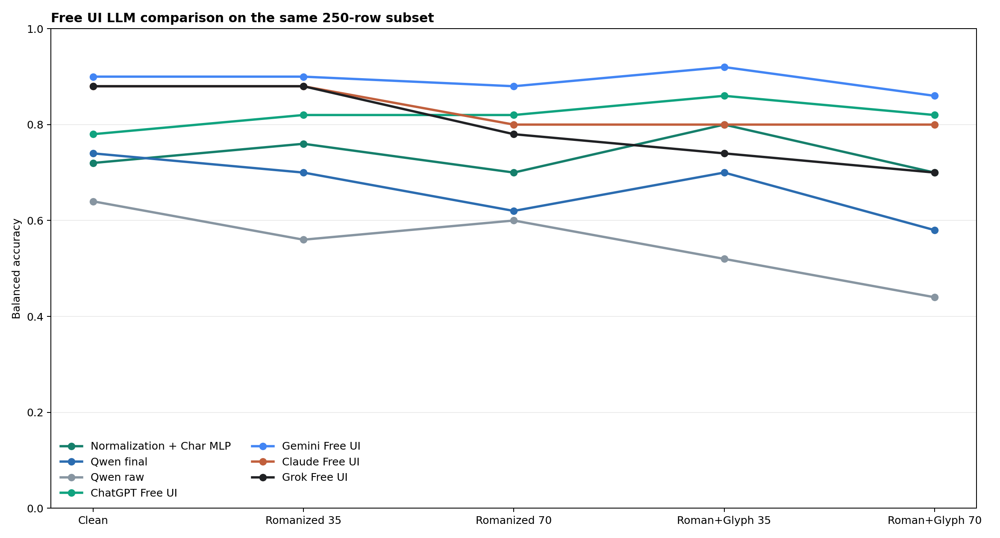
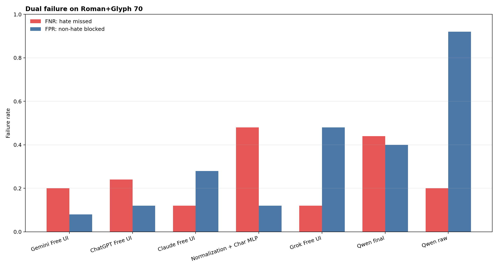

# 외부 무료 LLM 250개 공통 표본 비교 결과

## 실험 조건

- 실행일: 2026-06-13
- 동일 base comment: 50개
- Variant: 5개
- 총 입력: 시스템당 250개
- 각 variant: hate 25개, non-hate 25개
- UI 결과 형식 검증: 네 서비스 모두 250/250, 누락·중복·parse failure 0건

## 중요한 제한

- 팀원의 `RUN_LOG.csv`에 화면 표시 모델명이 기록되지 않았습니다.
- 따라서 결과는 특정 GPT/Claude/Gemini/Grok 모델 버전이 아니라 **2026-06-13 무료 UI 서비스 결과**입니다.
- 무료 UI는 backend 변경, fallback, rate limit을 통제할 수 없어 로컬 2,500개 실험과 분리한 supplementary comparison입니다.
- variant당 50개뿐이므로 Balanced Accuracy가 0.02 단위로 변합니다.

## Worst-case Robustness Ranking

| Rank | System | Worst BA | Worst max failure | Mean BA |
|---|---|---|---|---|
| 1 | Gemini Free UI | 0.860 | 0.200 | 0.892 |
| 2 | Claude Free UI | 0.800 | 0.360 | 0.832 |
| 3 | ChatGPT Free UI | 0.780 | 0.400 | 0.820 |
| 4 | Grok Free UI | 0.700 | 0.480 | 0.796 |
| 5 | Normalization + Char MLP | 0.700 | 0.480 | 0.736 |
| 6 | Qwen final | 0.580 | 0.520 | 0.668 |
| 7 | Qwen raw | 0.440 | 0.920 | 0.552 |

## Roman+Glyph 70

| System | BA | Macro F1 | FNR | FPR | Pred. hate rate |
|---|---|---|---|---|---|
| Gemini Free UI | 0.860 | 0.859 | 0.200 | 0.080 | 0.440 |
| ChatGPT Free UI | 0.820 | 0.819 | 0.240 | 0.120 | 0.440 |
| Claude Free UI | 0.800 | 0.799 | 0.120 | 0.280 | 0.580 |
| Normalization + Char MLP | 0.700 | 0.690 | 0.480 | 0.120 | 0.320 |
| Grok Free UI | 0.700 | 0.690 | 0.120 | 0.480 | 0.680 |
| Qwen final | 0.580 | 0.580 | 0.440 | 0.400 | 0.480 |
| Qwen raw | 0.440 | 0.357 | 0.200 | 0.920 | 0.860 |

## 핵심 해석

1. 무료 UI 모델 중 Gemini가 worst-case BA와 평균 BA 모두 가장 높았습니다.
2. ChatGPT는 FPR이 낮은 대신 clean FNR이 0.40으로 악성 댓글을 보수적으로 적게 잡았습니다.
3. Claude는 hate recall은 높지만 강한 romanization에서 FPR이 0.36까지 증가했습니다.
4. Grok은 Roman+Glyph 70에서 FPR 0.48로 정상 댓글 과잉 차단이 가장 크게 나타났습니다.
5. 직접 학습한 Qwen final은 raw Qwen보다 개선됐지만, 이 250개 표본에서는 무료 UI LLM보다 낮았습니다.
6. Normalization + Char MLP는 전체 2,500개 실험에서는 최종 1위였지만, 이 작은 250개 표본의 외부 LLM 비교에서는 순위가 달라질 수 있습니다.

## Figures

